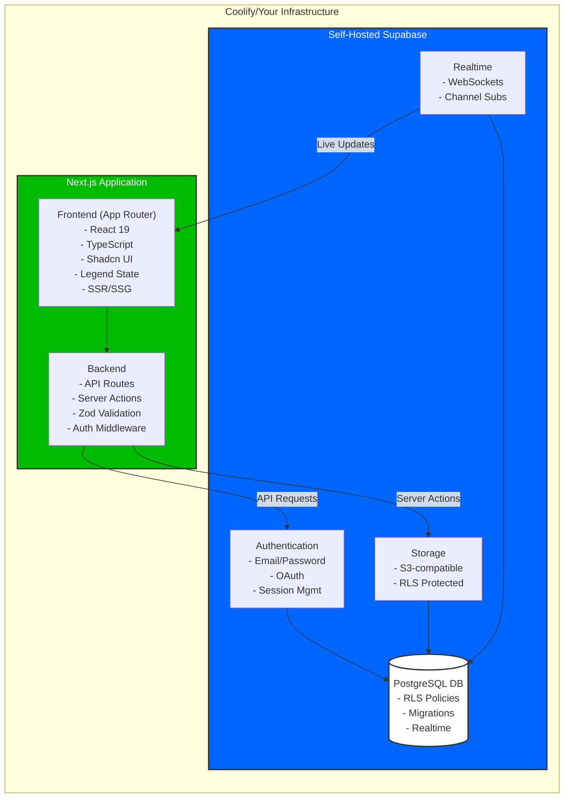

# Self-Hosted Next.js & Supabase Fullstack Starter Template

A production-ready template for building modern web applications with Next.js and self-hosted Supabase. Designed for developers who want full control over their stack while maintaining rapid development capabilities. Optimized for deployment on Coolify.



## Key Features:

- 🚀 Full-stack architecture with colocated frontend/backend
- 🔐 Self-hosted Supabase instance with automated migrations
- 🛡️ Enterprise-grade security patterns baked in
- 📊 Built-in observability with Sentry monitoring
- 📚 Auto-generated API documentation via Swagger
- ⚡ Lightning-fast development workflow with Legend State
- 🧪 Comprehensive testing suite (Playwright + Jest)
- 🔄 Real-time capabilities out-of-the-box

## Tech Stack

Here are the core technologies used in this project:

- 🚀 **Full-Stack Framework**: [Next.js](https://nextjs.org/) (App Router + API Routes)
- 🎨 **UI Components**: [Shadcn UI](https://ui.shadcn.com/) + [Tailwind CSS](https://tailwindcss.com/)
- 🗄️ **Database & Backend**: Self-hosted [Supabase](https://supabase.com/) (PostgreSQL, Auth, Storage)
- ⚡ **State Management**: [Legend State](https://legendapp.com/) for reactive state
- 📜 **API Docs**: Automated Swagger/OpenAPI documentation
- 🧪 **Testing**: [Playwright](https://playwright.dev/) E2E + [Jest](https://jestjs.io/) unit tests
- 🛡️ **Security**: Role-based access control & database RLS
- 📊 **Monitoring**: [Sentry](https://sentry.io/) error tracking
- 🔄 **Realtime**: Built-in Supabase realtime functionality

## Documentation

- [Architecture Overview](architecture.md) - System design and component relationships
- [Developer Guide](documentation.md) - Detailed setup and configuration instructions
- [Deployment Guide](deployment.md) - Coolify deployment strategies for all environments
- [Testing Strategy](documentation.md#testing-strategy) - E2E and unit testing guidelines

## Getting Started

Follow these steps to get your local development environment set up:

1. **Prerequisites**:

   - Node.js 22+ and npm
   - Supabase CLI (`npm install -g supabase`)
   - Docker Desktop (for local Supabase)
   - Coolify account (optional for deployment)

2. **Clone the repository**:

   ```bash
   git clone <repository_url>
   cd <repository_name>
   ```

3. **Install dependencies**:

   ```bash
   npm install
   ```

4. **Start local Supabase**:

   ```bash
   supabase start
   ```

5. **Apply database migrations**:

   ```bash
   supabase db migrate up
   ```

6. **Generate TypeScript types**:

   ```bash
   npm run supabase:genTypes
   ```

7. **Start development server**:
   ```bash
   npm run dev
   ```

Your application will be running at `http://localhost:3000`.

## Development Workflow

1. **Branching Strategy**:

   - Create feature branches from `staging`
   - PRs must include:
     - Playwright tests for new features
     - Supabase migrations if schema changes
     - Updated documentation

2. **Testing**:

   ```bash
   # Run all tests
   npm run test

   # Run specific test suite
   npm run test tests/e2e/auth.spec.ts
   ```

3. **Production Deployment**:

   ```bash
   # Build production bundle
   npm run build

   # Start production server
   npm run start
   ```

## Useful Scripts

| Script                      | Description                             |
| --------------------------- | --------------------------------------- |
| `npm run dev`               | Start development server                |
| `npm run build`             | Build production bundle                 |
| `npm run start`             | Start production server                 |
| `npm run test`              | Run all Playwright tests                |
| `npm run lint`              | Run ESLint checks                       |
| `npm run format`            | Format code with Prettier               |
| `npm run supabase:start`    | Start local Supabase instance           |
| `npm run supabase:stop`     | Stop local Supabase instance            |
| `npm run supabase:genTypes` | Generate TypeScript types from Supabase |

See [package.json](package.json) for all available scripts.

## Documentation

- [Architecture Overview](architecture.md) - System design and component relationships
- [Developer Guide](documentation.md) - Detailed setup and configuration instructions
- [Testing Strategy](documentation.md#testing-strategy) - E2E and unit testing guidelines
- [API Documentation](/api-docs) - Auto-generated Swagger docs (available in development)

## License

MIT License

---

**Contribution Guidelines**: We welcome contributions!
