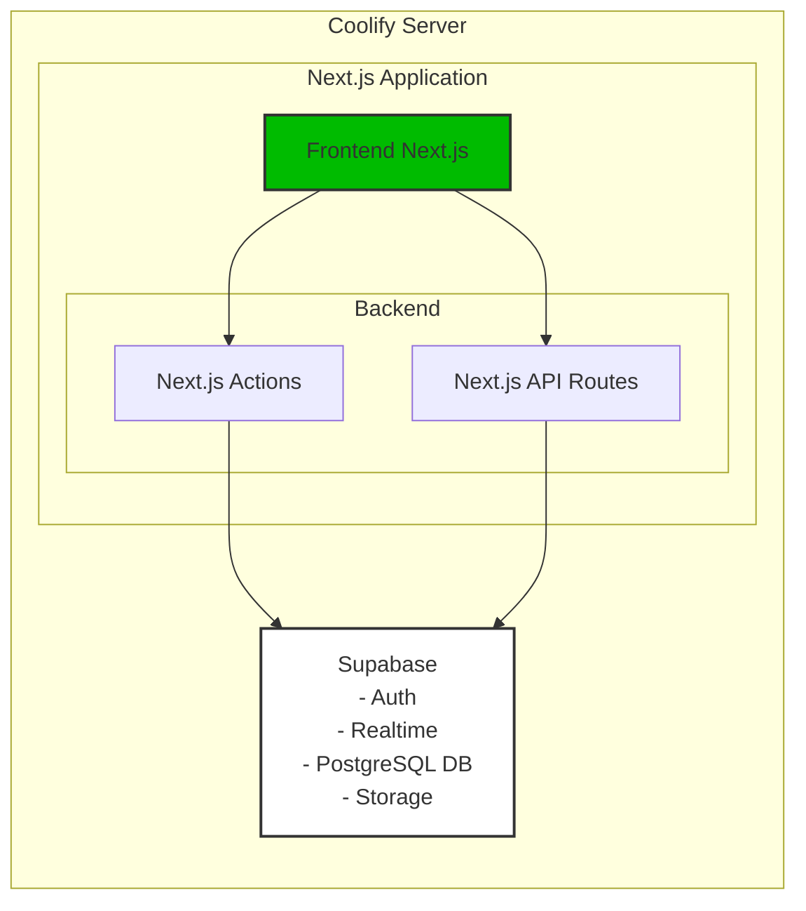
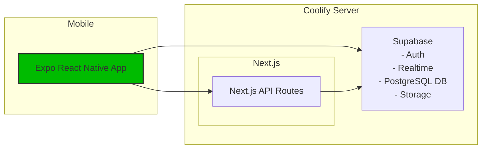
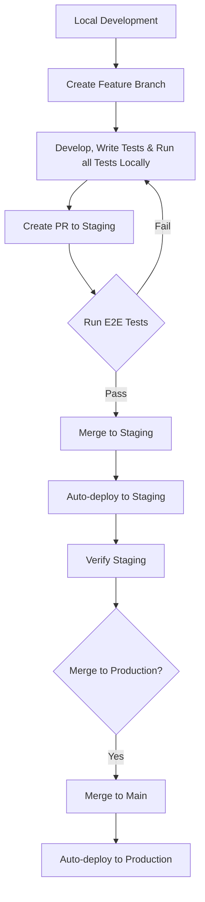
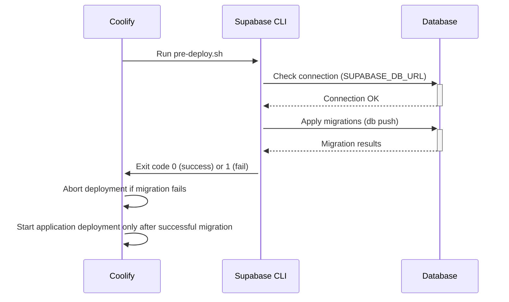
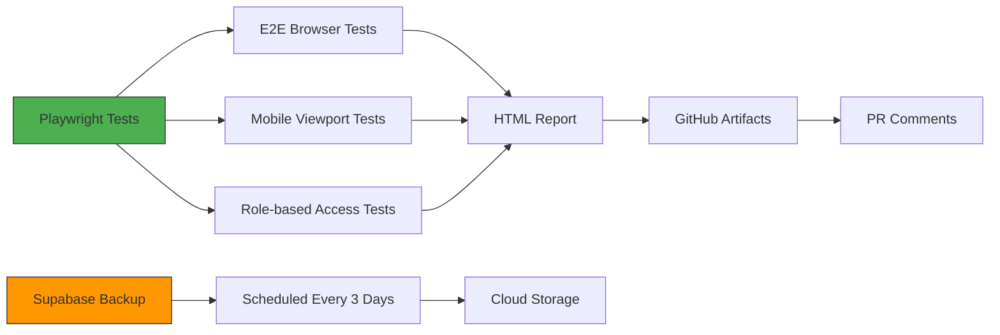

# Architecture

This document outlines the architecture of the SaaS template project, built with Next.js and self-hosted Supabase, designed for deployment on Coolify. The primary focus is on developer experience (DX) and a rapid development cycle.

## Core Components

1.  **Frontend (Next.js):**

    - Handles user interface and user interactions.
    - Built using React, TypeScript, Tailwind CSS, and Shadcn UI.
    - Utilizes server-side rendering (SSR) and static site generation (SSG) where appropriate for performance and SEO.
    - Manages application state using Legend State for reactive, fine-grained state management
    - Integrated with Sentry for real-time error monitoring and performance tracking

2.  **Backend (Next.js Actions & API Routes):**

    - **Next.js Actions:** Used for server-side logic that interacts directly with Supabase. These are colocated with React components for ease of development and deployment. Ideal for actions triggered by user interactions within the frontend (e.g., form submissions, data mutations).
    - **Next.js API Routes:** Provide a traditional API layer for functionalities that need to be exposed beyond the Next.js frontend. This is useful for:
      - Third-party integrations (e.g., mobile apps, external websites).
      - Webhooks.
      - Scheduled tasks (if needed, orchestrated externally or using edge functions).
    - **API Documentation:**
      - Automatic Swagger documentation generation
      - Accessible via `/api-docs` route
      - Production environment only exposes routes in `PUBLIC_API_ROUTES`
      - Development environment shows all API routes
      - Configured through JSDoc comments in API route handlers

3.  **Database (Self-hosted Supabase):**
    - Provides a complete backend-as-a-service (BaaS) solution.
    - Handles database management (PostgreSQL), authentication, storage, and real-time functionality.
    - Self-hosted on Coolify for full control and customization.
    - Managed using Supabase CLI for local development and migrations.
    - **Automated Production Backups**:
      - every 3 days at midnight UTC backups of the production database are configured using GitHub Actions and the Supabase CLI.
      - Backups are scheduled to run daily at midnight UTC via `.github/workflows/supabase-backup.yml`.
      - **Note:** Backup files are currently not automatically stored in a separate storage location. Further development is needed to upload backups to cloud storage (e.g., AWS S3, Google Cloud Storage) for secure retention and restore capabilities.

## Architecture Diagrams

### Web Application Architecture



### Architecture with Mobile App



**Important Notes:**

1. The current codebase focuses on web implementation only
2. For mobile development, we suggest:
   - Using Expo (React Native) for cross-platform development
   - Sharing validation logic (Zod schemas) between web and mobile
   - Reusing Next.js API routes where possible
   - Direct mobile->Supabase integration for Auth/Realtime
   - Creating a shared types package for TS types
3. Supabase services remain the single source of truth for:
   - User authentication
   - Real-time updates
   - Database operations
   - File storage

## Development Workflow



1.  **Local Development:**

    - Each developer sets up a local Supabase instance using the Supabase CLI. This ensures an isolated and consistent development environment.
    - Next.js application connects to the local Supabase instance.
    - Code changes and Supabase migrations are developed and tested locally.

2.  **Branching Strategy:**

    - **`staging` branch:** Represents the staging environment. Feature branches are created from and merged into this branch.
    - **`production` (main) branch:** Represents the production environment. Staging branch is merged into production after thorough testing and approval.
    - **Feature branches:** Developers create feature branches from `staging` for each new feature, task, or bug fix. Branch names should be descriptive (e.g., `feature/user-profiles`, `fix/login-bug`).

3.  **Pull Requests (PRs) and Merging:**

    - Once a feature is complete and tested locally, developers create a Pull Request (PR) to merge their feature branch into the `staging` branch.
    - **E2E Tests:** PRs must pass all E2E Playwright tests and must include tests for the new feature or bug fix.
    - **Code Review:** PRs undergo code review by other developers to ensure code quality and catch potential issues.
    - **Automated Testing:** Upon PR creation, automated E2E Playwright tests are run.
    - **Supabase Migrations:** If the feature includes database schema changes, a Supabase migration script should be created and included in the PR.

4.  **Staging Deployment:**

    - After successful code review, automated tests, and migration application, the PR is merged into the `staging` branch.
    - **Automated Deployment to Staging on Coolify:** Coolify is configured to automatically deploy the `staging` branch to the staging environment upon merge.
    - **Migration Execution on Staging:** As part of the staging deployment process (ideally _before_ the new application version is live), Supabase migrations are automatically applied to the staging Supabase instance. _(See "Supabase Migrations in Coolify Deployments" below)_

5.  **Production Deployment:**
    - After successful testing and validation in the staging environment, the `staging` branch is merged into the `production` (main) branch.
    - **Automated Deployment to Production on Coolify:** Coolify automatically deploys the `production` (main) branch to the production environment upon merge.
    - **Migration Execution on Production:** Similar to staging, Supabase migrations are automatically applied to the production Supabase instance as part of the production deployment process. _(See "Supabase Migrations in Coolify Deployments" below)_

## Supabase Migrations in Coolify Deployments



To ensure safe and reliable database migrations during Coolify deployments, use this pre deploy script on your Coolify deployment for the nextjs application:

```bash
./pre-deploy.sh
```

**Coolify Configuration**:

- Set as **Pre-deploy script** in Coolify UI for your nextjs application
- Required Environment Variables:

```env
SUPABASE_DB_URL
```

## Technologies Used

- **Next.js:** React framework for frontend and backend.
- **React:** JavaScript library for building user interfaces.
- **TypeScript:** Superset of JavaScript that adds static typing.
- **Tailwind CSS:** Utility-first CSS framework.
- **Shadcn UI:** Reusable UI components built with Radix UI and Tailwind CSS.
- **Zod:** Schema validation library for TypeScript.
- **Supabase:** Open-source Firebase alternative (PostgreSQL, Auth, Storage, Realtime).
- **Supabase CLI:** Command-line tool for managing Supabase projects.
- **Coolify:** Open-source PaaS for deploying applications.
- **Jest:** JavaScript testing framework.
- **Swagger UI:** Automated API documentation
- **swagger-jsdoc:** OpenAPI specification generation
- **Sentry:** Application monitoring and error tracking
- **Legend State:** Reactive state management library

## DX and Faster Development Cycle Focus

This architecture is designed to prioritize:

- **Rapid Iteration:** Next.js and Supabase provide a fast development loop, allowing developers to quickly build and deploy features.
- **Developer Friendliness:** TypeScript, Zod, Tailwind CSS, and Shadcn UI enhance code quality, maintainability, and ease of development.
- **Simplified Deployment:** Coolify automates deployment processes, reducing deployment friction.
- **Local Development Consistency:** Supabase CLI ensures consistent local development environments, minimizing "works on my machine" issues.
- **Clear Workflow:** Defined branching and PR strategies streamline collaboration and code management.

By focusing on these aspects, the SaaS template aims to provide a solid foundation for building and scaling applications efficiently.

- **Observability:** Sentry integration provides real-time insights into application errors and performance
- **Predictable State:** Legend State's observable-based state management ensures consistent data flow

## Deployment Rollback Strategy:

use coolify rollback

## Testing Strategy



- **E2E Tests:** Playwright tests for end-to-end testing of the application.
- **CI/CD Workflows:**
  - `playwright.yml`: Runs automated browser tests on every push/PR
  - `supabase-backup.yml`: Scheduled production database backups
- **Key Testing Features:**
  - Test database reset before each run
  - Mobile testing configurations
  - Parallel test execution
  - HTML report generation
  - Automatic PR comments with test results

### CI Workflow Configuration

Required GitHub Secrets for testing:

```env
SUPABASE_TEST_DB_URL
SUPABASE_SERVICE_ROLE_KEY_TEST
NEXT_PUBLIC_SUPABASE_TEST_URL
NEXT_PUBLIC_SUPABASE_TEST_ANON_KEY
```

Test suites follow a strict structure:

1. Database cleanup in afterAll hooks
2. Mobile viewport testing
3. Form validation coverage
4. Role-based access control verification
5. Full authentication flow testing

Production backups run every 3 days via:

```yaml
.github/workflows/supabase-backup.yml
```

E2E tests follow patterns from:

```yaml
.github/workflows/playwright.yml
```
