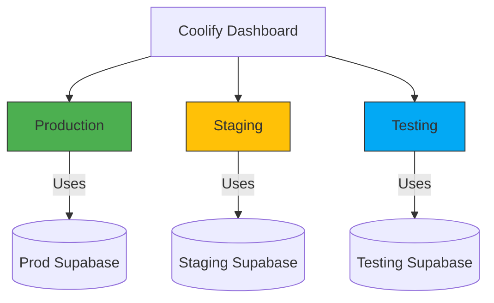
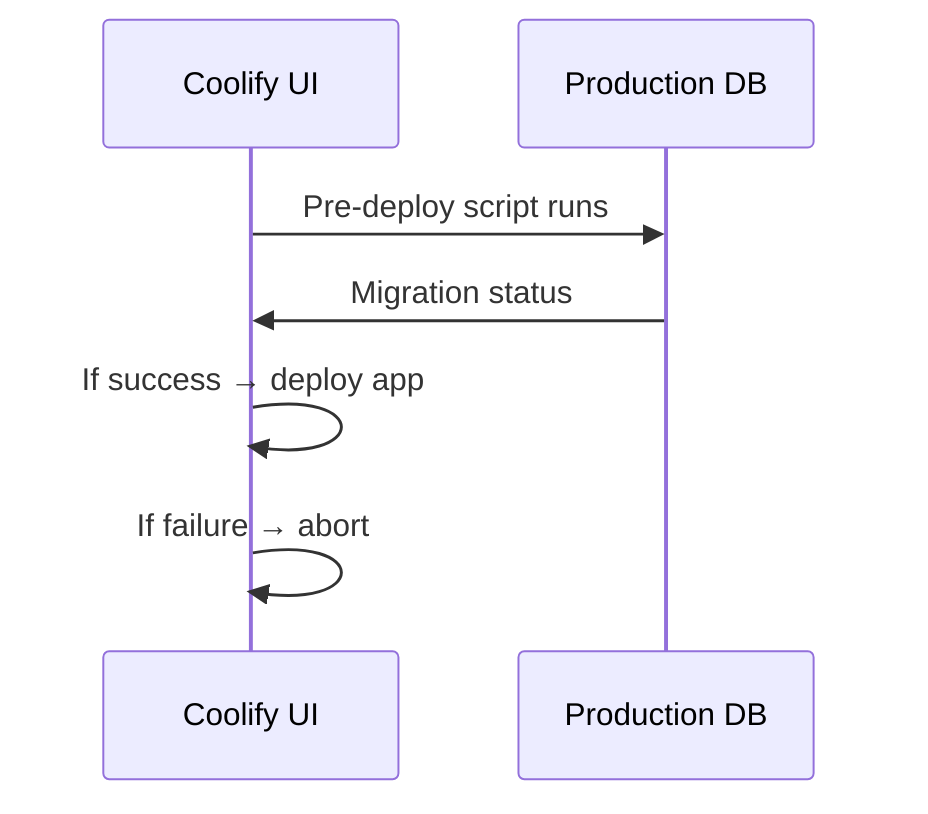

# Coolify UI Deployment Guide

This document explains how to deploy production, staging, and testing environments through the Coolify UI following our architecture patterns.



## Production Environment Setup

### 1. Next.js Application Setup

1. In Coolify UI:

   - Click "Add Service" → "Application"
   - Select your Git repository
   - Choose branch: `main`
   - Build pack: `Next.js`
   - Port: `3000`

2. Environment Variables:

   ```env
   NODE_ENV=production
   NEXT_PUBLIC_ENV=production
   NEXT_PUBLIC_SUPABASE_URL=<coolify-supabase-url>
   SUPABASE_SERVICE_ROLE_KEY=<coolify-supabase-service-role>
   SUPABASE_DB_URL=postgres://postgres:<password>@<coolify-supabase-host>:5432/postgres
   ```

3. Pre-deploy Script:
   ```bash
   chmod +x ./pre-deploy.sh && ./pre-deploy.sh
   ```

### 2. Supabase Database Setup

1. In Coolify UI:

   - Click "Add Service" → "Database"
   - Select "Supabase"
   - Version: `latest`
   - Enable "Production" toggle

2. After creation:
   - Copy "Connection String" for `SUPABASE_DB_URL`
   - Get `SUPABASE_SERVICE_ROLE_KEY` from Service Role section
   - Enable automatic backups in settings

## Staging Environment Setup

### 1. Next.js Staging Setup

1. Duplicate production service:

   - Change branch to `staging`
   - Update environment variables:
     ```env
     NEXT_PUBLIC_ENV=staging
     NEXT_PUBLIC_SUPABASE_URL=<staging-supabase-url>
     SUPABASE_SERVICE_ROLE_KEY=<staging-service-role>
     ```

2. Add Staging-specific features:
   - Enable "Show debug logs" in settings
   - Set health check path to `/api/health`

### 2. Supabase Staging DB

1. Create new Supabase service:
   - Name: `supabase-staging`
   - Enable "This is staging" toggle
   - Connect to staging Next.js app

## Testing Environment Setup

### 1. Supabase Testing DB

1. Create Supabase service:

   - Name: `supabase-test`
   - Enable "Ephemeral" mode (auto-cleanup)
   - Disable authentication providers

2. Get connection details:
   ```env
   NEXT_PUBLIC_SUPABASE_TEST_URL=<test-instance-url>
   SUPABASE_SERVICE_ROLE_KEY_TEST=<test-service-role>
   SUPABASE_TEST_DB_URL=postgres://postgres:<password>@<test-host>:5432/postgres
   ```

### 2. Playwright Configuration

1. In your local environment:
   ```bash
   # .env.test
   NEXT_PUBLIC_SUPABASE_TEST_URL=<coolify-test-url>
   SUPABASE_SERVICE_ROLE_KEY_TEST=<test-role-key>
   ```

## Migration Strategy



1. Ensure `pre-deploy.sh` exists in root:

   ```bash
   #!/bin/bash
   supabase db push --db-url=$SUPABASE_DB_URL
   ```

2. Verify in UI:
   - "Deployments" tab shows migration logs
   - Database health shows active connections

## Monitoring & Backups

1. Coolify UI Monitoring:

   - Resource usage graphs
   - Auto-healing restart
   - Log viewer integration

2. Supabase Backups:
   - Enable in Supabase service settings
   - Set backup schedule (recommended daily)
   - Configure S3-compatible storage

## Troubleshooting

1. Common Issues:

   - "Database connection refused":
     - Verify `SUPABASE_DB_URL` format
     - Check Coolify network policies
   - "Migrations failing":
     - Run `supabase db reset` locally
     - Verify migration file order

2. UI Indicators:
   - Red deployment status: Check logs
   - Yellow warning: Resource constraints
   - Purple icon: Pending migrations

## Security Checklist

- [ ] Rotate service role keys after initial setup
- [ ] Enable Coolify 2FA
- [ ] Configure production backup retention
- [ ] Enable Supabase RLS policies
- [ ] Restrict database public access
