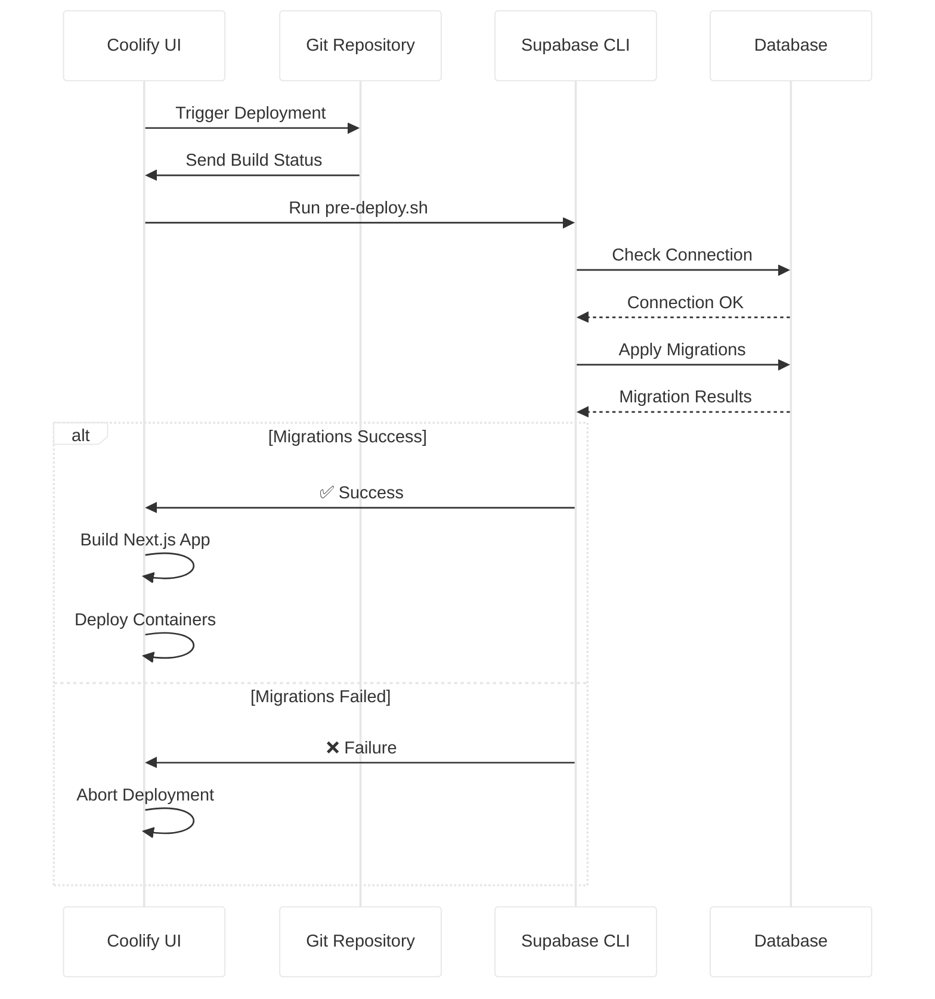
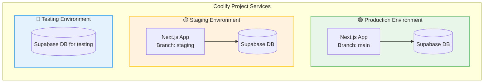

# Coolify UI Deployment Guide

This document explains how to deploy production, staging, and testing environments through the Coolify UI following our architecture patterns.



## Environment Relationships



## Production Environment Setup

### 1. Next.js Application

1. In Coolify UI:

   - **Service Type**: Application
   - **Repository**: Your Git repository
   - **Branch**: `main`
   - **Build Pack**: Next.js
   - **Port**: `3000`
   - **Pre-deploy Script**:
     ```bash
     chmod +x ./pre-deploy.sh && ./pre-deploy.sh
     ```

2. Environment Variables:
   ```env
   NODE_ENV=production
   NEXT_PUBLIC_ENV=production
   NEXT_PUBLIC_SUPABASE_URL=<coolify-supabase-url>
   SUPABASE_SERVICE_ROLE_KEY=<coolify-supabase-service-role>
   SUPABASE_DB_URL=postgres://postgres:<password>@<coolify-supabase-host>:5432/postgres
   ```

### 2. Supabase Database

1. Create New Service:

   - **Service Type**: Supabase
   - **Version**: Latest

2. Post-creation:
   - Make supabase db public
   - Copy Connection String → `SUPABASE_DB_URL`
   - Get Service Role Key → `SUPABASE_SERVICE_ROLE_KEY`
   - get annon key → `NEXT_PUBLIC_SUPABASE_ANON_KEY`
   - Get Supabase kong URL → `NEXT_PUBLIC_SUPABASE_URL`
   - Enable Automatic Backups

## Staging Environment Setup

### 1. Next.js Staging App

1. Duplicate Production Service:

   - **Branch**: `staging`
   - Update Environment Variables:
     ```env
     NEXT_PUBLIC_ENV=staging
     NEXT_PUBLIC_SUPABASE_URL=<staging-supabase-url>
     SUPABASE_SERVICE_ROLE_KEY=<staging-service-role>
     ```

2. Special Features:
   - Enable Debug Logging
   - Set Health Check Endpoint: `/api/health`
   - Reduce Auto-scaling Thresholds

### 2. Supabase Staging DB

1. Create New Instance:
   - **Name**: `supabase-staging`
   - **Toggle**: Staging Environment
   - Connect to Staging Next.js App

## Testing Environment Setup

### 2. Supabase Testing DB

1. Create Ephemeral Instance:

   - **Name**: `supabase-test`

2. Connection Details:
   ```env
   NEXT_PUBLIC_SUPABASE_TEST_URL=<test-instance-url>
   SUPABASE_SERVICE_ROLE_KEY_TEST=<test-role-key>
   SUPABASE_TEST_DB_URL=postgres://postgres:<password>@<test-host>:5432/postgres
   ```

## Monitoring & Backups

1. Next.js Monitoring:

   - Resource Usage Graphs
   - Request Latency Metrics
   - Error Rate Tracking

2. Supabase Backups:
   - backup Snapshots every 3 days using github workflows

## Troubleshooting

1. Common Issues:

   - **App Crash**: Check Pre-deploy Logs
   - **DB Connection**: Verify Network Policies
   - **Migration Failures**: Validate SQL Schemas

2. UI Indicators in coolify ui:
   - 🔴 Red: Critical Failure
   - 🟡 Yellow: Performance Issues
   - 🟢 Green: Healthy

## Security Checklist

- [ ] Rotate Service Role Keys
- [ ] Enable RLS Policies
- [ ] Configure Backup Encryption
- [ ] Enable Coolify 2FA
- [ ] Restrict Public DB Access
