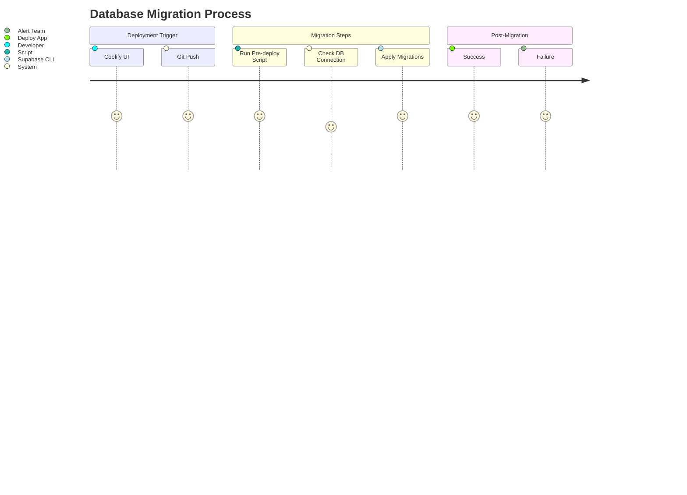
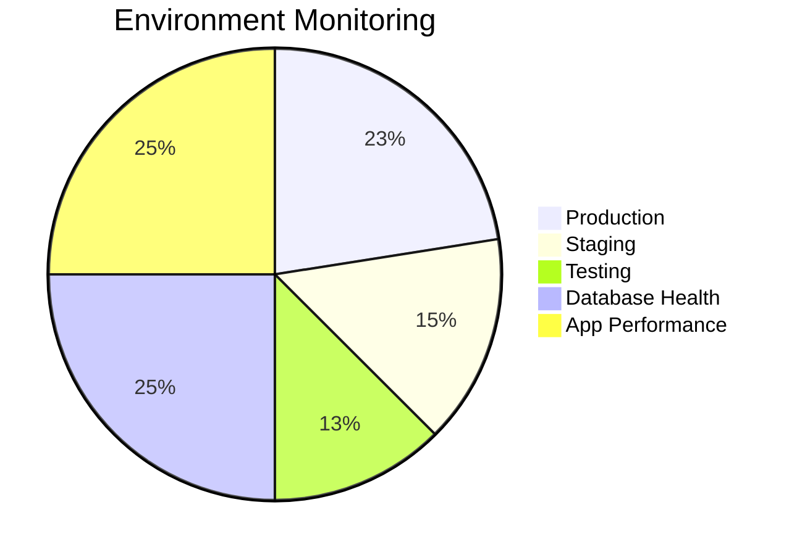

# Coolify UI Deployment Guide

This document explains how to deploy production, staging, and testing environments through the Coolify UI following our architecture patterns.

```mermaid
%%{init: {'theme': 'base', 'themeVariables': { 'primaryColor': '#fff'}}}%%
sequenceDiagram
    participant U as Coolify UI
    participant G as Git Repository
    participant S as Supabase CLI
    participant D as Database

    U->>G: Trigger Deployment
    G->>U: Send Build Status
    U->>S: Run pre-deploy.sh
    S->>D: Check Connection
    D-->>S: Connection OK
    S->>D: Apply Migrations
    D-->>S: Migration Results
    alt Migrations Success
        S->>U: ✅ Success
        U->>U: Build Next.js App
        U->>U: Deploy Containers
    else Migrations Failed
        S->>U: ❌ Failure
        U->>U: Abort Deployment
    end
```



## Environment Relationships


## Production Environment Setup

### 1. Next.js Application

1. In Coolify UI:

   - **Service Type**: Application
   - **Repository**: Your Git repository
   - **Branch**: `main`
   - **Build Pack**: Next.js
   - **Port**: `3000`
   - **Pre-deploy Script**:
     ```bash
     chmod +x ./pre-deploy.sh && ./pre-deploy.sh
     ```

2. Environment Variables:
   ```env
   NODE_ENV=production
   NEXT_PUBLIC_ENV=production
   NEXT_PUBLIC_SUPABASE_URL=<coolify-supabase-url>
   SUPABASE_SERVICE_ROLE_KEY=<coolify-supabase-service-role>
   SUPABASE_DB_URL=postgres://postgres:<password>@<coolify-supabase-host>:5432/postgres
   ```

### 2. Supabase Database

1. Create New Service:

   - **Service Type**: Supabase
   - **Version**: Latest

2. Post-creation:
   - Make supabase db public
   - Copy Connection String → `SUPABASE_DB_URL`
   - Get Service Role Key → `SUPABASE_SERVICE_ROLE_KEY`
   - get annon key → `NEXT_PUBLIC_SUPABASE_ANON_KEY`
   - Get Supabase kong URL → `NEXT_PUBLIC_SUPABASE_URL`
   - Enable Automatic Backups

## Staging Environment Setup

### 1. Next.js Staging App

1. Duplicate Production Service:

   - **Branch**: `staging`
   - Update Environment Variables:
     ```env
     NEXT_PUBLIC_ENV=staging
     NEXT_PUBLIC_SUPABASE_URL=<staging-supabase-url>
     SUPABASE_SERVICE_ROLE_KEY=<staging-service-role>
     ```

2. Special Features:
   - Enable Debug Logging
   - Set Health Check Endpoint: `/api/health`
   - Reduce Auto-scaling Thresholds

### 2. Supabase Staging DB

1. Create New Instance:
   - **Name**: `supabase-staging`
   - **Toggle**: Staging Environment
   - Connect to Staging Next.js App

## Testing Environment Setup

### 1. Next.js Testing App

1. Create New Service:

   - **Branch**: `test/playwright`
   - **Environment Variables**:
     ```env
     NODE_ENV=test
     NEXT_PUBLIC_ENV=test
     NEXT_PUBLIC_SUPABASE_URL=<test-supabase-url>
     SUPABASE_SERVICE_ROLE_KEY=<test-service-role>
     ```

2. Testing Features:
   - Disable SSR
   - Enable Test Mode
   - No Caching

### 2. Supabase Testing DB

1. Create Ephemeral Instance:

   - **Name**: `supabase-test`
   - **Toggle**: Ephemeral Mode
   - Disable Auth Providers

2. Connection Details:
   ```env
   NEXT_PUBLIC_SUPABASE_TEST_URL=<test-instance-url>
   SUPABASE_SERVICE_ROLE_KEY_TEST=<test-role-key>
   SUPABASE_TEST_DB_URL=postgres://postgres:<password>@<test-host>:5432/postgres
   ```

## Migration Strategy



1. Required `pre-deploy.sh`:

   ```bash
   #!/bin/bash
   supabase db push --db-url=$SUPABASE_DB_URL
   ```

2. Verification:
   - Check Deployment Logs
   - Monitor Database Health

## Monitoring & Backups



1. Next.js Monitoring:

   - Resource Usage Graphs
   - Request Latency Metrics
   - Error Rate Tracking

2. Supabase Backups:
   - Daily Snapshots
   - Point-in-Time Recovery
   - S3-Compatible Storage

## Troubleshooting

1. Common Issues:

   - **App Crash**: Check Pre-deploy Logs
   - **DB Connection**: Verify Network Policies
   - **Migration Failures**: Validate SQL Schemas

2. UI Indicators:
   - 🔴 Red: Critical Failure
   - 🟡 Yellow: Performance Issues
   - 🟢 Green: Healthy

## Security Checklist

- [ ] Rotate Service Role Keys
- [ ] Enable RLS Policies
- [ ] Configure Backup Encryption
- [ ] Enable Coolify 2FA
- [ ] Restrict Public DB Access
