# Developer Documentation

This document provides a guide for developers on how to set up, develop, and contribute to the SaaS template project.

## Project Setup

1.  **Prerequisites:**

    - **Node.js and npm:** Ensure you have Node.js and npm (Node Package Manager) installed on your system. You can download them from [nodejs.org](https://nodejs.org/).
    - **Supabase CLI:** Install the Supabase CLI globally. Follow the installation instructions for your operating system in the [Supabase CLI documentation](https://supabase.com/docs/reference/cli/install).
    - **Coolify Account (for deployment):** If you plan to deploy to Coolify, you'll need a Coolify account and a project set up.

2.  **Clone the Repository:**

    ```bash
    git clone <repository_url>
    cd <repository_name>
    ```

3.  **Install Dependencies:**

    ```bash
    npm install
    ```

4.  **Set up Local Supabase:**

    - Initialize a local Supabase project within your project directory:
      ```bash
      supabase init
      ```
    - Start the local Supabase services:
      ```bash
      supabase start
      ```
      This will start the Supabase stack (PostgreSQL, GoTrue, Storage, etc.) in Docker. Make sure you have Docker Desktop running.
    - **Environment Variables:** The `supabase start` command will output environment variables needed for your Next.js application to connect to the local Supabase instance. Typically, these are `NEXT_PUBLIC_SUPABASE_URL` and `NEXT_PUBLIC_SUPABASE_ANON_KEY`. These are usually automatically added to a `.env.local` file. If not, or if you need to adjust them, create a `.env.local` file in your project root and add these variables:

      ```env
      NEXT_PUBLIC_SUPABASE_URL=<your_supabase_url>  # e.g., http://localhost:54321
      NEXT_PUBLIC_SUPABASE_ANON_KEY=<your_supabase_anon_key> # e.g., your anon key
      ```

5.  **Run Migrations:**

    - Apply the initial database migrations to your local Supabase instance:
      ```bash
      supabase db migrate up
      ```

6.  **Generate Supabase Typescript Types:**

    - Generate TypeScript types based on your Supabase database schema. This provides type safety when interacting with your database in your Next.js application:
      ```bash
      npm run supabase:genTypes
      ```

7.  **Start the Next.js Development Server:**
    ```bash
    npm run dev
    ```
    Your Next.js application should now be running at `http://localhost:3000`.

## Development Workflow Diagram

```mermaid
graph LR
A[Start Feature Branch from Staging] --> B{Develop Feature & Migrations};
B --> C[Test Locally];
C --> D{Create Pull Request to Staging};
D --> E{Code Review & Automated Tests};
E -- Pass --> F[Merge to Staging];
E -- Fail --> B;
F --> G[Automated Deploy to Staging coolify];
G --> H[Test on Staging Environment];
H -- Pass --> I{Merge Staging to Production};
H -- Fail --> B;
I --> J[Automated Deploy to Production Coolify];
J --> K[Production Environment Live];
style B fill:#000,stroke:#333,stroke-width:2px
style G fill:#000,stroke:#333,stroke-width:2px
style J fill:#000,stroke:#333,stroke-width:2px
```



## Branching and Pull Requests

- **Branching:** Always create feature branches from the `staging` branch. Use descriptive branch names like `feature/add-user-profiles` or `fix/login-bug`.
- **Pull Requests (PRs):**
  - When your feature or fix is complete and tested locally, create a PR to merge your feature branch into the `staging` branch.
  - Clearly describe the changes in your PR description.
  - Include any relevant screenshots or screen recordings if applicable.
  - Respond to code review feedback and address any issues raised.
  - Ensure all automated tests pass before merging.

## Supabase Migrations

- **Creating Migrations:** When you make changes to your Supabase database schema (e.g., adding tables, columns, or modifying existing ones), you need to create a Supabase migration. Use the Supabase CLI to generate a new migration file:
  ```bash
  supabase db diff --project-id <your_local_project_id> --schema public
  supabase db migrate new <migration_name>
  ```
  Replace `<your_local_project_id>` with your local Supabase project ID (found in `supabase/.env`) and `<migration_name>` with a descriptive name for your migration (e.g., `add_user_profile_table`).
- **Applying Migrations Locally:** Apply migrations to your local Supabase instance using:
  ```bash
  supabase db migrate up
  ```
- **Including Migrations in PRs:** When you create a PR, include any new migration files in the `supabase/migrations` directory.
- **Automated Migrations in Deployments:** As described in `architecture.md`, migrations are automatically applied to staging and production environments during the Coolify deployment process using a Post-deploy script.

## Running Tests

- **Unit Tests:** Run unit tests using Jest:
  ```bash
  npm run test
  ```
- **Watch Mode:** For continuous testing during development:
  ```bash
  npm run test:watch
  ```
- **Writing Tests:** Write unit tests for your components, utility functions, and backend logic to ensure code quality and prevent regressions. _(Guidance on writing effective tests can be added here in more detail later)_

## Coolify Deployment Setup (High-Level)

_(This section can be expanded with more Coolify-specific details as needed)_

1.  **Connect your Git Repository to Coolify.**
2.  **Configure a Coolify Application for your Next.js Frontend.**
    - Set up environment variables (especially Supabase connection variables for staging and production Supabase instances).
    - Configure build and start commands (likely `npm run build` and `npm run start`).
    - **Crucially, configure a Post-deploy script** as described in `architecture.md` to run Supabase migrations on each deployment.
3.  **Configure a Coolify Database Service for your Self-hosted Supabase (PostgreSQL).**
    - Or, if you are using Coolify's "Supabase" service, configure that accordingly.
    - Ensure your Next.js application and Supabase service can communicate within the Coolify network.

## Package.json Scripts

Refer to the `package.json` scripts section in `architecture.md` for a description of the scripts available to streamline development tasks.

## Code Style and Conventions

- **Linting:** The project is configured with ESLint and Prettier to enforce code style and catch potential errors. Run linting:
  ```bash
  npm run lint
  ```
  Ideally, set up your editor to automatically run Prettier on save and ESLint to show errors in your editor.
- **TypeScript:** Write all code in TypeScript for type safety and improved code maintainability.
- **Zod for Validation:** Use Zod for schema validation for both frontend and backend data.
- **Component Library:** Utilize Shadcn UI component library for consistent and accessible UI elements.
- **Tailwind CSS:** Use Tailwind CSS utility classes for styling. Follow Tailwind CSS best practices for maintainability.

By following these guidelines, developers can effectively contribute to the SaaS template project and maintain a high level of code quality and development velocity.

## API Documentation

The project uses Swagger (OpenAPI) for API documentation generation. The documentation is automatically generated from JSDoc comments in your API route handlers.

### Key Features:

- **Local Development:** All API routes are documented when running locally
- **Production:** Only routes in the `PUBLIC_API_ROUTES` array are documented
- **Access:** Documentation is available at `/api-docs` in your Next.js application

### Configuration:

- Defined in `utils/api-docs.ts`
- Public routes are specified in the `PUBLIC_API_ROUTES` array
- Swagger UI is automatically generated based on environment:

```typescript
apis: process.env.NODE_ENV == "development"
  ? ["./app/api/**/*.ts"] // All routes in development
  : PUBLIC_API_ROUTES; // Only public routes in production
```

To access the API documentation:

1. Run the application locally with `npm run dev`
2. Visit `http://localhost:3000/api-docs`
