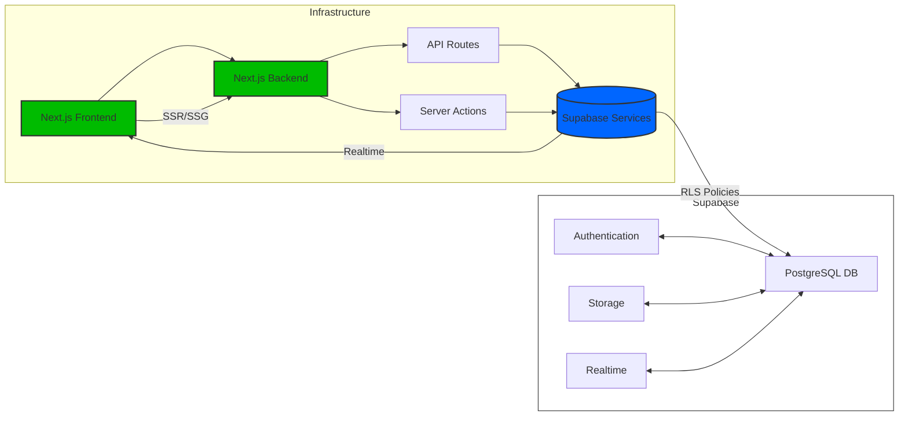
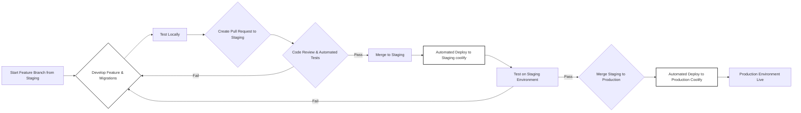

# Developer Documentation

This document provides a guide for developers on how to set up, develop, and contribute to the Next.js + Supabase starter template.

## Project Setup

1.  **Prerequisites:**

    - **Node.js and npm:** Ensure you have Node.js and npm (Node Package Manager) installed on your system. You can download them from [nodejs.org](https://nodejs.org/) or with [nvm](https://github.com/nvm-sh/nvm).
    - **Supabase CLI:** Install the Supabase CLI globally. Follow the installation instructions for your operating system in the [Supabase CLI documentation](https://supabase.com/docs/reference/cli/install).
    - **Coolify (for deployment):** If you plan to deploy to Coolify, you'll need a Coolify account and a project set up. [Learn more about Coolify here](https://coolify.io/).

2.  **Clone the Repository:**

    ```bash
    git clone <repository_url>
    cd <repository_name>
    ```

3.  **Install Dependencies:**

    ```bash
    npm install
    ```

4.  **Set up Local Supabase:**

    - Initialize a local Supabase project within your project directory:
      ```bash
      supabase init
      ```
    - Start the local Supabase services:
      ```bash
      supabase start
      ```
      This will start the Supabase stack (PostgreSQL, GoTrue, Storage, etc.) in Docker. Make sure you have Docker Desktop running.
    - **Environment Variables:** The `supabase start` command will output environment variables needed for your Next.js application to connect to the local Supabase instance. Typically, these are `NEXT_PUBLIC_SUPABASE_URL` and `NEXT_PUBLIC_SUPABASE_ANON_KEY`. These are usually automatically added to a `.env.local` file. If not, or if you need to adjust them, create a `.env.local` file in your project root and add these variables:

      ```env
      NEXT_PUBLIC_SUPABASE_URL=<your_supabase_url>  # e.g., http://localhost:54321
      NEXT_PUBLIC_SUPABASE_ANON_KEY=<your_supabase_anon_key> # e.g., your anon key
      ```

5.  **Run Migrations:**

    - Apply the initial database migrations to your local Supabase instance:
      ```bash
      supabase db migrate up
      ```

6.  **Generate Supabase Typescript Types:**

    - Generate TypeScript types based on your Supabase database schema. This provides type safety when interacting with your database in your Next.js application:
      ```bash
      npm run supabase:genTypes
      ```

7.  **Start the Next.js Development Server:**

    ```bash
    npm run dev
    ```

    Your Next.js application should now be running at `http://localhost:3000`.

    ## Architecture Overview



**Key Architectural Decisions:**

1. Full-stack colocation for rapid iteration
2. Supabase as single source of truth for:
   - Authentication
   - Real-time updates
   - Database operations
   - File storage
3. TypeScript-first development
4. Security-by-default with RLS and role checks

## Development Workflow Diagram



## Branching and Pull Requests

- **Branching:** Always create feature branches from the `staging` branch. Use descriptive branch names like `feature/add-user-profiles` or `fix/login-bug`.
- **Pull Requests (PRs):**
  - When your feature or fix is complete and tested locally, create a PR to merge your feature branch into the `staging` branch.
  - Clearly describe the changes in your PR description.
  - Include any relevant screenshots or screen recordings if applicable.
  - Respond to code review feedback and address any issues raised.
  - Ensure all automated tests pass before merging.

## Supabase Migrations

- **Creating Migrations:** When you make changes to your Supabase database schema (e.g., adding tables, columns, or modifying existing ones), you need to create a Supabase migration. Use the Supabase CLI to generate a new migration file:
  ```bash
  supabase db diff --project-id <your_local_project_id> --schema public
  supabase db migrate new <migration_name>
  ```
  Replace `<your_local_project_id>` with your local Supabase project ID (found in `supabase/.env`) and `<migration_name>` with a descriptive name for your migration (e.g., `add_user_profile_table`).
- **Applying Migrations Locally:** Apply migrations to your local Supabase instance using:
  ```bash
  supabase db migrate up
  ```
- **Including Migrations in PRs:** When you create a PR, include any new migration files in the `supabase/migrations` directory.
- **Automated Migrations in Deployments:** As described in `architecture.md`, migrations are automatically applied to staging and production environments during the Coolify deployment process using a Post-deploy script.

## Running Tests

- **Unit Tests:** Run unit tests using Jest:
  ```bash
  npm run test
  ```
- **Watch Mode:** For continuous testing during development:
  ```bash
  npm run test:watch
  ```
- **Writing Tests:** Write unit tests for your components, utility functions, and backend logic to ensure code quality and prevent regressions. _(Guidance on writing effective tests can be added here in more detail later)_

## End-to-End Testing

We use Playwright for comprehensive end-to-end testing. Key test suites include:

1. **Authentication Flow** (`tests/e2e/auth.spec.ts`):

   - User registration with OTP
   - Login flow validation
   - Form validation and error handling
   - Email normalization tests

2. **Account Management** (`tests/e2e/account.spec.ts`):

   - Profile updates
   - Marketing preferences
   - Avatar uploads
   - Account deletion flow

3. **Role-Based Access Control** (`tests/e2e/userRole.spec.ts`):
   - Admin vs regular user access
   - Dashboard permission checks
   - Automatic redirects for unauthorized users

Tests run automatically on every pull request and push via the Playwright CI workflow (`.github/workflows/playwright.yml`). Key features:

- Test database reset before each run
- HTML report artifact upload
- Automatic PR comments with test results
- Parallel test execution

## Coolify Deployment Setup (High-Level)

_(This section can be expanded with more Coolify-specific details as needed)_

1.  **Connect your Git Repository to Coolify.**
2.  **Configure a Coolify Application for your Next.js Frontend.**
    - Set up environment variables (especially Supabase connection variables for staging and production Supabase instances).
    - Configure build and start commands (likely `npm run build` and `npm run start`).
    - **Crucially, configure a Post-deploy script** as described in `architecture.md` to run Supabase migrations on each deployment.
3.  **Configure a Coolify Database Service for your Self-hosted Supabase (PostgreSQL).**
    - Or, if you are using Coolify's "Supabase" service, configure that accordingly.
    - Ensure your Next.js application and Supabase service can communicate within the Coolify network.

## Package.json Scripts

The `package.json` file includes several scripts to streamline common development tasks:

- `dev`: Starts the Next.js development server.
- `build`: Builds the Next.js application for production.
- `start`: Starts the Next.js production server.
- `lint`: Runs ESLint for code linting.
- `lint:fix`: Runs ESLint and automatically fixes linting errors where possible.
- `test`: Runs Jest unit tests.
- `test:watch`: Runs Jest unit tests in watch mode.
- `supabase:genTypes`: Generates TypeScript types from your Supabase database schema.

## Code Style and Conventions

- **Linting:** The project is configured with ESLint and Prettier to enforce code style and catch potential errors. Run linting:
  ```bash
  npm run lint
  ```
  Ideally, set up your editor to automatically run Prettier on save and ESLint to show errors in your editor.
- **TypeScript:** Write all code in TypeScript for type safety and improved code maintainability.
- **Zod for Validation:** Use Zod for schema validation for both frontend and backend data.
- **Component Library:** Utilize Shadcn UI component library for consistent and accessible UI elements.
- **Tailwind CSS:** Use Tailwind CSS utility classes for styling. Follow Tailwind CSS best practices for maintainability.

- **State Management:** Use Legend State for reactive state management across components. Legend State provides:
  - Fine-grained reactivity with observable objects
  - Automatic re-rendering of components when state changes
  - Simple API for managing both local and global state
  - Excellent TypeScript support
  - Example usage from sidebar component:

By following these guidelines, developers can effectively contribute to the project and maintain a high level of code quality and development velocity.

## Monitoring and Error Tracking

The project uses Sentry for error tracking and performance monitoring. Key features:

- Automatic error capturing in both client and server-side code
- Performance monitoring for page loads and API routes
- Environment-based configuration should be set in `.env.local` using `NEXT_PUBLIC_SENTRY_ENABLED`

To configure Sentry:

1. Set environment variables in `.env.local`:

```env
NEXT_PUBLIC_SENTRY_ENABLED=true
```

## Production Database Backups

Production database backups are automated using GitHub Actions.

### Setup

1.  **GitHub Actions Secrets:**
    - Navigate to your GitHub repository's "Settings" > "Secrets and variables" > "Actions".
    - Ensure you have a repository secret named `SUPABASE_PRODUCTION_DB_URL` configured. This secret should contain the connection string (URL) to your production Supabase database. **This is critical for the backup script to connect to your database.**

### How Backups Work

- **Scheduled Daily Backups:** A GitHub Actions workflow defined in `.github/workflows/supabase-backup.yml` is scheduled to run daily at midnight UTC.
- **Supabase CLI `backup` Command:** The workflow uses the supabase cli to executes the Supabase CLI command `supabase db backup --db-url $SUPABASE_DB_URL`.
- **Automated Execution:** The GitHub Action automatically runs this script on the schedule and when manually triggered.

### Manually Triggering Backups

You can manually trigger a backup at any time:

1.  Go to the "Actions" tab in your GitHub repository.
2.  Find the "Supabase Backup" workflow in the left sidebar.
3.  Click on the "Supabase Backup" workflow.
4.  Click the "Run workflow" button.
5.  (Optional) Select the branch to run the workflow on (usually `main` or `production`).
6.  Click "Run workflow" to start the backup process.

### Monitoring Backups

- **Check Workflow Runs:** After manually triggering or waiting for a scheduled backup, you can monitor the workflow's execution in the "Actions" tab.
- **Workflow Logs:** Click on the workflow run to view detailed logs, including the output of the `supabase db backup` command. Check the logs for any errors or issues during the backup process.

### Backup Storage (Current Status and Future Improvements)

- **Current Status:** The backup process now saves the database backup as a GitHub Artifact.
- **GitHub Artifacts:** The backup is uploaded as an artifact named `supabase-backup` to the GitHub Actions workflow run.

  - **Download Artifacts:** You can download the backup file (`supabase_backup_<timestamp>.sql`) from the workflow run summary page under the "Artifacts" section.
  - **Retention:** GitHub Artifacts have a retention period (currently 90 days by default, but this can be configured for your repository). Backups will be automatically deleted after this period.
  - **Size Limits:** Be aware of GitHub Artifact size limits. If your database backups are very large, they might exceed these limits, and the artifact upload could fail. For very large databases, consider using dedicated cloud storage solutions as outlined in "Future Improvements" below.

- **Future Improvements:** To enhance backup security and restore capabilities, the following improvements are planned:
  - **Cloud Storage Upload:** Modify the GitHub Actions workflow to upload the generated backup file to a cloud storage service like AWS S3, Google Cloud Storage, or Azure Blob Storage for long-term storage and more robust retention policies.
  - **Backup Retention Policy:** If using cloud storage, implement a strategy to manage and retain backups (e.g., keep daily backups for a week, weekly backups for a month, etc.) and automate the deletion of old backups.
  - **Automated Restore Process (Future):** Potentially develop scripts or documentation for easily restoring backups from cloud storage to your Supabase instance.

For now, the backups are conveniently available as GitHub Artifacts for a limited retention period. For more robust and long-term backup storage, consider migrating to cloud storage as a next step.

**To download a backup:**

1.  Go to the "Actions" tab in your GitHub repository.
2.  Click on the "Supabase Backup" workflow in the left sidebar.
3.  Select the workflow run you want to download the backup from (e.g., the latest successful run).
4.  Scroll down to the "Artifacts" section.
5.  You should see an artifact named `supabase-backup`. Click on it to download the `supabase_backup_<timestamp>.sql` file containing your database backup.

## API Documentation

The project uses Swagger (OpenAPI) for API documentation generation. The documentation is automatically generated from JSDoc comments in your API route handlers.

### Key Features:

- **Local Development:** All API routes are documented when running locally
- **Production:** Only routes in the `PUBLIC_API_ROUTES` array are documented
- **Access:** Documentation is available at `/api-docs` in your Next.js application

### Configuration:

- Defined in `utils/api-docs.ts`
- Public routes are specified in the `PUBLIC_API_ROUTES` array
- Swagger UI is automatically generated based on environment:

```typescript
apis: process.env.NODE_ENV == 'development'
  ? ['./app/api/**/*.ts'] // All routes in development
  : PUBLIC_API_ROUTES; // Only public routes in production
```

To access the API documentation:

1. Run the application locally with `npm run dev`
2. Visit `http://localhost:3000/api-docs`

## GitHub Actions Secrets

The following secrets must be configured in your GitHub repository (Settings > Secrets > Actions):

| Secret Name                          | Description                                                        |
| ------------------------------------ | ------------------------------------------------------------------ |
| `SUPABASE_PRODUCTION_DB_URL`         | Connection URL for production Supabase database (used for backups) |
| `SUPABASE_TEST_DB_URL`               | Connection URL for test database (used in CI/CD)                   |
| `SUPABASE_SERVICE_ROLE_KEY_TEST`     | Service role key for test environment                              |
| `NEXT_PUBLIC_SUPABASE_TEST_URL`      | Public Supabase URL for test environment                           |
| `NEXT_PUBLIC_SUPABASE_TEST_ANON_KEY` | Anonymous key for test environment                                 |
| `SENTRY_AUTH_TOKEN`                  | Authentication token for Sentry error tracking                     |

## CI Workflows

- `playwright.yml`: Runs E2E tests on PRs/pushes
- `supabase-backup.yml`: Automated production DB backups (every 3 days)

See [documentation.md](documentation.md#github-actions-secrets) for required GitHub secrets setup.
