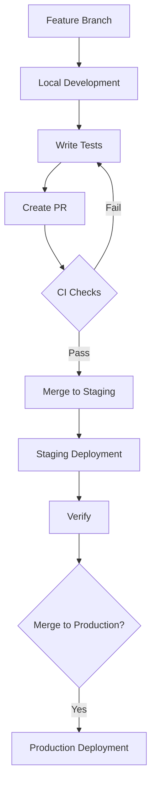

# Architecture Documentation

## Core Architecture


### Key Components

1. **Next.js Frontend (App Router)**

   - Built with React 19+ and TypeScript
   - UI Components: Shadcn UI + Tailwind CSS
   - State Management: Legend State observables
   - Features:
     - Server-side rendering (SSR)
     - Static site generation (SSG)
     - Dynamic imports for heavy components
     - Role-based routing (admin/user)
     - Real-time updates via Supabase

2. **Next.js Backend**

   - **API Routes**:
     - REST endpoints for external integrations
     - Protected by JWT authentication
     - Swagger documentation auto-generation
   - **Server Actions**:
     - Colocated with frontend components
     - Handle form submissions/data mutations
     - Direct Supabase interactions
   - Shared Features:
     - Zod schema validation
     - Sentry error monitoring
     - Rate limiting (TODO)

3. **Supabase Services**
   - **PostgreSQL Database**:
     - Managed via migrations
     - Row-Level Security (RLS) enforced
     - TypeScript types auto-generated
   - **Authentication**:
     - Email/password + OAuth providers
     - Session management via middleware
   - **Storage**:
     - S3-compatible bucket system
     - RLS-protected file access
   - **Realtime**:
     - WebSocket-based updates
     - Database change listeners

## Development Workflow



### Key Processes

1. **Local Development**

   - Supabase CLI for local DB
   - Hot-reload development server
   - Test data seeding (TODO)

   ```bash
   npm run dev
   supabase start
   ```

2. **Testing**

   - Playwright E2E tests:
     ```bash
     npm run test
     ```
   - Test scenarios:
     - Authentication flows
     - Role-based access control
     - Mobile responsiveness
     - API endpoint validation

3. **Deployment**
   - Coolify-managed deployments
   - Zero-downtime migrations
   - Automated backups
   ```bash
   # Production build
   npm run build
   ```

## Security Architecture

### Protection Layers

1. **Network Layer**

   - HTTPS enforced
   - CORS restrictions
   - Rate limiting (TODO)

2. **Application Layer**

   - Zod input validation
   - Server-side form handling
   - CSRF protection (Next.js built-in)
   - Secure cookies configuration

3. **Database Layer**

   - Row-Level Security (RLS)
   - Service role key isolation
   - Automated backups

   ```sql
   -- Example RLS Policy
   CREATE POLICY "User data access" ON users
   USING (auth.uid() = id);
   ```

4. **Authentication**
   - Session refresh middleware
   - OTP protection on critical actions
   - Password complexity rules
   ```ts
   // Example auth check
   const {
     data: { user },
   } = await supabase.auth.getUser();
   if (!user) redirect('/auth');
   ```

## API Documentation

### Swagger Integration

1. **Access Points**

   - Development: `/api-docs`
   - Production: Only public routes

2. **Adding Documentation**

   ```ts
   /**
    * @swagger
    * /api/users:
    *   get:
    *     summary: Get user list
    *     security:
    *       - bearerAuth: []
    *     responses:
    *       200:
    *         description: User list
    */
   export async function GET() {
     // Implementation
   }
   ```

3. **Security Schemes**
   - Bearer token authentication
   - Role-based access control
   - Rate limit headers (TODO)

## Deployment Guide

**Related Documents**:

- [Architecture Overview](./architecture.md)
- [Full Deployment Guide](./deployment.md)

### Backup Strategy

1. **Database Backups**

   - Daily snapshots
   - Cloud storage integration (TODO)

   ```bash
   supabase backup create
   ```

2. **Disaster Recovery**
   - Point-in-time recovery
   - Multi-region replication (TODO)
   ```bash
   supabase backup restore <backup-id>
   ```

## Maintenance

### Monitoring

1. **Sentry Dashboard**

   - Error tracking
   - Performance metrics
   - Release health

2. **Supabase Metrics**
   - Database load
   - Storage usage
   - Realtime connections

### Updates

1. **Dependencies**

   ```bash
   npm outdated
   npm update
   ```

2. **Database Migrations**

   ```bash
   supabase migration new <name>
   supabase db push
   ```

3. **Type Generation**
   ```bash
   npm run supabase:genTypes
   ```
